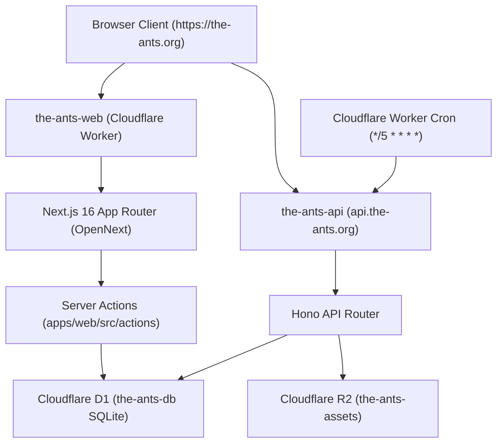

# The ANTs — Architecture & Fast Lookup Guide for AI Agents

> **AI AGENT QUICKSTART**: Read this document first before exploring the codebase. You do not need to scan the entire project to fix a bug or add a feature. Use the **Feature Fast Lookup Table** below to jump directly to the relevant files.

---

## 1. System Overview & Monorepo Topology



| Package / App | Technology | Deployment Target | Purpose |
|---|---|---|---|
| `apps/web` | Next.js 16 (App Router), React 19, Tailwind CSS v4 | Cloudflare Worker (`the-ants-web`) on `https://the-ants.org` | Main web app, student dashboard, study tools, public marketing |
| `apps/api` | Hono, Better Auth, Cloudflare Workers Types | Cloudflare Worker (`the-ants-api`) on `https://api.the-ants.org` | Auth endpoints, role upgrade, storage, cron notification queue |
| `packages/db` | Drizzle ORM, Cloudflare D1 (SQLite) | Bound directly as `env.DB` to Web & API Workers | Single source of truth for all relational data |
| `packages/shared-types` | TypeScript, Zod | Shared workspace dependency | Shared schemas and API interfaces |

---

## 2. Feature Fast Lookup Table (Find Anything in 10 Seconds)

Jump directly to the files you need based on the feature you are touching:

| Feature / Tool | URL Route | Page Entry | Primary UI Components | Server Action / Logic | DB Schema & Tables |
|---|---|---|---|---|---|
| **Student Dashboard** | `/student`, `/dashboard` | `apps/web/src/app/(app)/student/page.tsx` | `DashboardLayout.tsx`, `DashboardExamCountdown.tsx`, `ScholarQuickStartChecklist.tsx` | `actions/curriculum.ts`, `actions/exam-data.ts`, `actions/gamification.ts` | `profiles`, `user_enrollments`, `exams` |
| **Exam Countdown** | `/countdown` | `apps/web/src/app/(app)/countdown/page.tsx` | `components/dashboard/DashboardExamCountdown.tsx`, `components/countdown/` | `actions/exam-data.ts` (`listExams`, `listExamCountdownsForUser`) | `exams`, `exam_countdowns` in `schema/study_tools.ts` |
| **Grade Calculator** | `/calculator` | `apps/web/src/app/(app)/calculator/page.tsx` | `components/calculator/` | `lib/calculator/` engine, `packages/db` | `grade_boundaries` in `schema/study_tools.ts` |
| **Past Paper Tracker** | `/past-papers` | `apps/web/src/app/(app)/past-papers/page.tsx` | `components/past-papers/` | `actions/past-papers.ts` | `past_paper_logs`, `past_paper_matrices` in `schema/study_tools.ts` |
| **Smart Timetable** | `/timetable` | `apps/web/src/app/(app)/timetable/page.tsx` | `components/timetable/` | `actions/timetable.ts` | `timetable_events` in `schema/study_tools.ts` |
| **Pomodoro Timer** | `/pomodoro` | `apps/web/src/app/(app)/pomodoro/page.tsx` | `components/pomodoro/` | `actions/pomodoro.ts` | `pomodoro_sessions`, `pomodoro_user_settings` in `schema/study_tools.ts` |
| **Curriculum & Syllabi** | `/curriculum`, `/[curriculumId]`, `/[subjectId]` | `apps/web/src/app/(app)/curriculum/**` | `components/curriculum/` | `actions/curriculum.ts`, `actions/enrollment-sync.ts` | `curriculums`, `subjects`, `topics`, `subject_units` in `schema/curriculums.ts` |
| **Scholar Leaderboard** | `/leaderboard` | `apps/web/src/app/(app)/leaderboard/page.tsx` | `components/gamification/` | `actions/leaderboard.ts`, `actions/gamification.ts` | `gamification_profiles`, `user_xp_transactions` in `schema/study_tools.ts` |
| **User Profiles & Settings** | `/settings`, `/settings/profile`, `/profile/[u]` | `apps/web/src/app/(app)/settings/**` | `components/settings/`, `components/profile/` | `actions/profile.ts` | `profiles` in `schema/profiles.ts` |
| **Telegram Notifications** | Settings & `/api/telegram/*` | `apps/web/src/app/api/telegram/webhook/route.ts` | `components/settings/NotificationSettings.tsx` | `actions/telegram.ts`, `actions/notifications.ts` | `notification_queue`, `notification_preferences` in `schema/system.ts` |
| **Tutors & Contributors** | `/team`, `/explore` | `apps/web/src/app/(public)/team/page.tsx` | `components/explore/TutorsContributorsPageContent.tsx` | `actions/org.ts` | `profiles`, `contributors` in `schema/community.ts` |
| **Landing & Marketing** | `/`, `/about` | `apps/web/src/app/page.tsx`, `apps/web/src/app/(public)/about/page.tsx` | `components/homepage/BentoFeatures.tsx`, `HowItWorks.tsx`, `NavBar.tsx` | Client UI & static content | Static / Constants in `constants/homepage.ts` |
| **Auth (Login/Signup)** | `/login`, `/signup` | `apps/web/src/app/(auth)/**` | `components/auth/` | `better-auth` client via `api.the-ants.org` | `users`, `sessions`, `accounts` in `schema/auth.ts` |

---

## 3. Database Schema Structure (`packages/db/src/schema/`)

All D1 tables are defined in modular files:
- [`auth.ts`](file:///c:/Users/USER/Desktop/The-ANTS/packages/db/src/schema/auth.ts): Better Auth tables (`user`, `session`, `account`, `verification`).
- [`profiles.ts`](file:///c:/Users/USER/Desktop/The-ANTS/packages/db/src/schema/profiles.ts): `profiles` table (role, username, bio, achievements, persona).
- [`curriculums.ts`](file:///c:/Users/USER/Desktop/The-ANTS/packages/db/src/schema/curriculums.ts): `curriculums`, `subjects`, `topics`, `subject_units`, `chapters`.
- [`study_tools.ts`](file:///c:/Users/USER/Desktop/The-ANTS/packages/db/src/schema/study_tools.ts): `exams`, `exam_countdowns`, `grade_boundaries`, `past_paper_logs`, `timetable_events`, `pomodoro_sessions`, `gamification_profiles`.
- [`community.ts`](file:///c:/Users/USER/Desktop/The-ANTS/packages/db/src/schema/community.ts): `tutors`, `contributors`, `org_activities`.
- [`system.ts`](file:///c:/Users/USER/Desktop/The-ANTS/packages/db/src/schema/system.ts): `notification_queue`, `notification_preferences`, `cron_logs`.

---

## 4. Key Engineering Invariants (Do Not Break)

1. **Strictly Retired Features (Never Reintroduce)**:
   - ❌ **Clubs & Classrooms** are completely deleted. Do not recreate routes, tables, or navigation links for them.
   - ❌ **Legacy `/courses` and `/lessons`** routes redirect to `/curriculum`. All subject material lives under `/curriculum`.
   - ❌ **Notion integration** is retired. Study tools are 100% native SQLite / D1.
   - ❌ **Neon / Supabase / QStash** are retired. Only Cloudflare D1 + Worker Cron (`*/5 * * * *`).

2. **Styling & Design System**:
   - **Theme**: Stitch Academic System. Light (`#f8fafc` canvas, `#d97706` amber primary) and Dark (`#090a0f` obsidian, `#f59e0b` amber accent).
   - **Semantic Tokens Only**: Always use Tailwind semantic classes: `bg-background`, `bg-background-card`, `border-border`, `text-foreground`, `text-foreground-secondary`, `text-foreground-muted`, `bg-primary`, etc.
   - **Typography**: Plus Jakarta Sans for UI copy; JetBrains Mono (`font-mono tabular-nums`) for timers, sitting times, numbers, syllabus codes.
   - **Icons**: `lucide-react` ONLY.

3. **Data Access Pattern**:
   - In Next.js App Router server actions or server components, use `getDb()` from `@/lib/db`. It automatically uses Cloudflare D1 binding `env.DB` in production and local SQLite proxy in development.

4. **Roles**:
   - Standard roles: `'student' | 'tutor' | 'teacher' | 'contributor' | 'main_contributor' | 'admin'`.
   - Signup is always strictly `'student'`. Higher roles are granted only by admins.

---

## 5. Standard CLI Commands

```bash
# Development
npm run dev              # Run web (port 3005) + API with remote D1 (port 8787)
npm run dev:web          # Web only on port 3005
npm run dev:api          # API only on port 8787

# Verification (ALWAYS run before opening PR or declaring work complete)
npm run typecheck        # Runs TypeScript check across all 4 monorepo packages
npm run build:web        # Validates Next.js build and route generation

# Deployment (Cloudflare Workers)
npm run cf:deploy:api    # Deploys API Worker (the-ants-api -> api.the-ants.org)
npm run cf:deploy:web    # Builds OpenNext and deploys Web Worker (the-ants-web -> the-ants.org)
```
