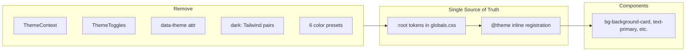

# Logo-Aligned Unified Theme Refactor

## Design Direction

The logo establishes a **two-tone warm palette**:

| Role | Hex | Source |
|---|---|---|
| Brand gold (primary) | `#C59419` | Ant + pencil silhouette |
| Brand gold hover | `#A67D14` | ~15% darker for interactive states |
| Brand gold light | `rgba(197,148,25,0.12)` | Tinted backgrounds, focus rings |
| Page cream | `#FDF9F3` | Logo background |
| Section cream | `#F5F0E6` | Secondary surfaces |
| Card white | `#FFFCF7` | Elevated cards on cream |
| Ink (text) | `#2A261E` | Warm charcoal-brown (readable on cream) |
| Ink secondary | `#4A453C` | Body / secondary text |
| Ink muted | `#7A7468` | Placeholders, captions |
| Border | `rgba(197,148,25,0.14)` | Gold-tinted, subtle |
| Accent (secondary) | `#D4A84B` | Lighter gold for highlights / gradients |

This replaces the current blue/emerald/neon system. Semantic colors (success, error, warning) stay functional but get warm-tinted neutrals where they touch brand surfaces.

---

## Phase 1 — CSS Token Foundation

**File:** [`src/app/globals.css`](src/app/globals.css)

1. **Collapse to a single `:root` block** — move all usable values into one scheme; delete the `[data-theme="dark"]` block (~lines 78–124) and every `[data-theme="light"]` / `[data-theme="dark"]` selector (~32 occurrences across homepage, nav, neon, dashboard utilities).
2. **Apply logo palette** to app tokens (`--background`, `--primary`, `--accent`, borders, shadows, glass). Update `--shadow-glow` to gold: `0 0 24px rgba(197,148,25,0.20)`.
3. **Retire blue neon homepage styling** — rewrite `.hp` tokens to use the same cream/gold palette (the homepage light tokens in [`design-system/design-system.md`](design-system/design-system.md) §2.2 are already close: `#FFFDF9` → align to `#FDF9F3`, `#D0692B` amber → logo gold `#C59419`). Remove indigo/blue `--hp-brand`, `--neon-glow-cyan`, and dark-neon variants.
4. **Simplify homepage utilities** — `.hp-nav`, `.hp-grad`, `.neon-*`, `.dash-welcome-glass`, `.illus-tab-card--active` become single-scheme (no theme conditionals).
5. **Keep `@theme inline`** registration unchanged structurally; values flow from updated `:root` vars.
6. **Remove** `body` theme transition (`background-color 0.3s ease`) — no longer switching themes.

---

## Phase 2 — Remove Theme Infrastructure

| File | Action |
|---|---|
| [`src/context/ThemeContext.tsx`](src/context/ThemeContext.tsx) | **Delete** entire file (285 lines: `ThemeProvider`, `useTheme`, `COLOR_PRESETS`, localStorage keys) |
| [`src/app/layout.tsx`](src/app/layout.tsx) | Remove `ThemeProvider` wrapper and import |
| [`src/components/layout/NavBar.tsx`](src/components/layout/NavBar.tsx) | Remove `useTheme`, Sun/Moon imports, theme toggle button (~lines 675–682) |
| [`src/app/page.tsx`](src/app/page.tsx) | Remove `useTheme`, homepage theme toggle button (~lines 121, 242–255) |
| [`src/app/(app)/settings/page.tsx`](src/app/(app)/settings/page.tsx) | Remove entire **Appearance** section (`ThemeModeToggle`, `ColorPalettePicker`, Palette/Sun/Moon imports) |
| [`src/app/(public)/about/page.tsx`](src/app/(public)/about/page.tsx) | Collapse inline `<style>` blocks that gate neon glow on `[data-theme="dark"]` — apply gold glow unconditionally |

There is no standalone `ThemeToggle.tsx`; toggles are inline in NavBar and homepage.

---

## Phase 3 — Strip `dark:` Utility Pairs (~200 instances, 21 files)

Replace light/dark conditional Tailwind with **dark-scheme-equivalent or semantic** classes:

| Pattern | Replacement |
|---|---|
| `bg-white dark:bg-zinc-900` | `bg-background-card` |
| `border-zinc-200 dark:border-zinc-800` | `border-border` |
| `text-zinc-900 dark:text-white` | `text-foreground` |
| `bg-white dark:bg-zinc-950` (inputs) | `bg-background-secondary` |
| `text-orange-500 bg-orange-500/10 dark:text-orange-400 dark:bg-orange-500/20` | `text-orange-400 bg-orange-500/20` |
| `text-blue-600 bg-blue-50 dark:bg-blue-900/30 dark:text-blue-300` | `text-blue-300 bg-blue-900/30` |

**Affected files** (highest impact first):

- [`src/components/exam-editor/EvaluationMatrix.tsx`](src/components/exam-editor/EvaluationMatrix.tsx) (29)
- [`src/components/exam-editor/BoundaryWeightForm.tsx`](src/components/exam-editor/BoundaryWeightForm.tsx) (22)
- [`src/app/(app)/editor/exam/schedule/page.tsx`](src/app/(app)/editor/exam/schedule/page.tsx) (22)
- [`src/components/exam-editor/ScheduleTimelineInput.tsx`](src/components/exam-editor/ScheduleTimelineInput.tsx) (20)
- [`src/app/(app)/main-contributor/page.tsx`](src/app/(app)/main-contributor/page.tsx) (18)
- [`src/app/(app)/teacher/page.tsx`](src/app/(app)/teacher/page.tsx) (18)
- [`src/app/(app)/student/page.tsx`](src/app/(app)/student/page.tsx) (18)
- [`src/components/layout/DashboardLayout.tsx`](src/components/layout/DashboardLayout.tsx) (18)
- [`src/constants/qualifications.ts`](src/constants/qualifications.ts) (14)
- [`src/components/workspace/WorkspaceToast.tsx`](src/components/workspace/WorkspaceToast.tsx) (10)
- [`src/components/workspace/MyWorkspace.tsx`](src/components/workspace/MyWorkspace.tsx) (9)
- 10 additional files with 1–4 instances each

**DRY opportunity:** The duplicated `STAT_COLOR_MAP` object appears identically in 4 dashboard files — extract to [`src/constants/statColors.ts`](src/constants/statColors.ts) with logo-appropriate single-scheme values, import in all 4 consumers.

---

## Phase 4 — Design System Documentation

Update UI/UX docs to match the new architecture (no backend changes):

| File | Updates |
|---|---|
| [`design-system/design-system.md`](design-system/design-system.md) | Replace dual light/dark tables with single logo palette; remove color-preset section; update "Where Colors Live" to drop `ThemeContext.tsx`; add design decision log entry |
| [`design-system/08-theming.md`](design-system/08-theming.md) | Rewrite: single `:root` scheme, no `useTheme()`, no localStorage keys, homepage uses same gold/cream tokens |

---

## Phase 5 — Residual Hardcoded Colors

Grep and fix remaining non-semantic Tailwind in components already touched or visibly brand-critical:

- `focus:border-blue-500 focus:ring-blue-500` in exam editor → `focus:border-primary focus:ring-primary`
- NavBar gradient accents (`from-emerald-500`, `from-sky-500`, etc.) — keep role-differentiation but shift cool blues toward warm gold/amber family where they represent brand (Library group can use `from-amber-600 to-yellow-500`)
- `@keyframes glow` in globals.css still references blue `rgba(77,166,255,...)` → gold rgba

**Out of scope:** Backend, Supabase, API routes, database schema, business logic, mock data.

---

## Verification Checklist

- `npm run dev` — no import errors from deleted `ThemeContext`
- Homepage, dashboard, settings, exam editor, library pages render with cream backgrounds and gold CTAs
- No `data-theme` attribute on `<html>`; no theme toggle buttons visible
- Grep confirms zero `dark:` in `src/` (except comments if any)
- Grep confirms zero imports from `@/context/ThemeContext`
- Contrast: gold `#C59419` on cream `#FDF9F3` ≈ 3.2:1 (large text OK); primary buttons use `--primary-foreground: #FFFFFF` on gold for AA compliance
