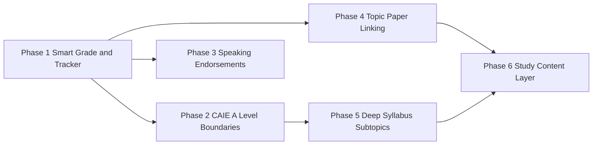

# Implementation Plans — Exam Data & Study Tools

> **Purpose:** Durable, repo-local plans so future chats (or developers) can continue work without losing context from the original design session.
>
> **Created:** 2026-09-19 · **Owner:** Thaw Ye Zaw (features/backend)

---

## How to use these plans

1. **Use Agent mode** — Plan mode only allows markdown edits; implementation requires Agent mode.
2. **Start a new Cursor chat** (or continue current) and paste the **Handoff prompt** from the target phase file.
3. Read the phase doc fully before coding — it captures user decisions, file paths, and acceptance criteria.
4. Check **Prerequisites** — do not start a later phase until its dependencies are merged.
5. Cross-reference [`docs/seeds/target-catalog.md`](../seeds/target-catalog.md) and [`AGENTS.features.md`](../../AGENTS.features.md) for ownership rules.

---

## Roadmap overview

| Phase | Doc | Status | Summary |
|-------|-----|--------|---------|
| **1** | [`phase-1-smart-grade-tracker.md`](./phase-1-smart-grade-tracker.md) | **Implemented** (`TYZ_feature`) | Subject-first calculator, past paper tracker redesign, IGCSE/Edexcel seed refresh, component routes, chapter-level subtopics |
| **2** | [`phase-2-caie-alevel-boundaries.md`](./phase-2-caie-alevel-boundaries.md) | **Deferred** (skip for now) | CAIE A Level grade boundaries — infra ready; resume when GB PDFs added |
| **3** | [`phase-3-speaking-endorsements.md`](./phase-3-speaking-endorsements.md) | Planned | 0510 Component 04, 4ES1 Paper 03 — optional endorsement tracking |
| **4** | [`phase-4-topic-paper-linking.md`](./phase-4-topic-paper-linking.md) | **Cancelled** | User decision: topic tracker and past paper tracker stay unrelated |
| **5** | [`phase-5-deep-syllabus-subtopics.md`](./phase-5-deep-syllabus-subtopics.md) | **In progress** | `{ code, title }` objectives in seeds; TopicTracker search by code; legacy progress preserved |
| **6** | [`phase-6-study-content-layer.md`](./phase-6-study-content-layer.md) | Future | Notes, flashcards, quizzes wired to topic/paper tags |

---

## Locked product decisions (all phases)

These were confirmed in the 2026-09-19 planning session and must not be reversed without explicit user approval:

| Topic | Decision |
|-------|----------|
| Calculator primary flow | **Subject-first**; single-paper mode is secondary |
| Variant default | **Myanmar Zone 4** (CIE v2 / Edexcel R) for grade calculator |
| Variant scope | **Equivalent papers only** (22↔21↔23, 1HR↔1H) |
| AS / A Level | **Enrollment-driven**; editable in tracker + settings |
| IAL enrollment | **Cash-in primary**; units grouped in UI; auto-enroll compulsory + pick optional |
| Tracker layout | Desktop: wide grid (rows=papers×variants); Mobile: flipped (rows=sessions, scroll papers) |
| Tracker variants | **Show all seeded**; Myanmar highlight; calculator has separate variant toggle |
| Subject composite grade | **Official boundaries only** — no percentage fallback |
| Progress metric | **Required papers** in student's selected route only |
| Speaking | **Excluded** from tracker in Phase 1 (Phase 3 adds optional tracking) |
| ICT 0417 | **Series-auto** paper filter |
| Countdown | **Syncs** with enrollment/route/tier changes |
| Topics ↔ Papers | **Independent** — no linking; completing a past paper does not update topic progress |
| Subtopic depth (Phase 1) | **3–8 chapter bullets** from syllabus PDFs |
| CAIE A Level reserved | **Wait for GB PDFs** before activation (Phase 2) |
| Delivery Phase 1 | **Single coordinated PR** |

**Reference mapping:** Myanmar papers, component routes, and IAL unit rules are documented in the user's reference spec (also summarized in Phase 1 doc). Source PDFs live under [`packages/db/seeds/pdfs/`](../packages/db/seeds/pdfs/).

---

## Related docs

| File | Purpose |
|------|---------|
| [`docs/seeds/README.md`](../seeds/README.md) | Seed apply playbook |
| [`docs/seeds/target-catalog.md`](../seeds/target-catalog.md) | Supported syllabi + reserved IDs |
| [`docs/seeds/exam-data-spec.md`](../seeds/exam-data-spec.md) | Past papers + boundaries schema |
| [`docs/seeds/curriculum-spec.md`](../seeds/curriculum-spec.md) | Topics schema |
| [`packages/shared-types/src/exam-papers.ts`](../../packages/shared-types/src/exam-papers.ts) | Myanmar paper allowlists (single source of truth) |

---

## Cursor plan mirror

Phase 1 is also tracked in Cursor's plan UI (`.cursor/plans/smart_grade_&_tracker_620a0024.plan.md`). **This repo folder is the canonical long-term store** — update both when Phase 1 scope changes.
