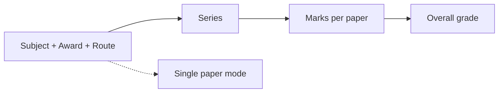

# Phase 1 — Smart Grade Calculator, Past Paper Tracker & Seed Alignment

> **Status:** Implemented (2026-09-19) — apply migration `0007_component_routes_enrollment.sql` to D1 before deploy  
> **Prerequisites:** None  
> **Estimated scope:** Large single PR (schema + seeds + 3 feature surfaces)  
> **Blocks:** Phase 2, 3, 4

### To start implementation

1. In Cursor chat, **switch from Plan mode to Agent mode** (or approve the mode-switch prompt).
2. Send: `start phase 1` or `execute phase 1 from docs/plans/phase-1-smart-grade-tracker.md`
3. Agent will follow the **Implementation order** section below.

---

## Handoff prompt (paste into new chat)

```
Implement Phase 1 from docs/plans/phase-1-smart-grade-tracker.md in The ANTS repo.

Read first:
- docs/plans/README.md (locked decisions)
- docs/plans/phase-1-smart-grade-tracker.md (this file)
- packages/shared-types/src/exam-papers.ts
- apps/web/src/components/exam-data/GradeCalculator.tsx
- apps/web/src/components/past-papers/PaperGrid.tsx

Goal: subject-first grade calculator, responsive past paper tracker with subject-level progress,
re-seed IGCSE/Edexcel boundaries from packages/db/seeds/pdfs/, activate reserved non-CAIE-AL subjects,
chapter-level subtopics from syllabus PDFs.

Do NOT start CAIE A Level boundary seeding (Phase 2). Speaking endorsements excluded (Phase 3).
Run npm run typecheck before finishing.
```

---

## Goal

Make grade calculation and past paper tracking **subject-aware** for Myanmar students: pick your route (9709 Mechanics vs Statistics, IAL M1+S1, sciences 33 vs 34), see overall subject progress and official composite grades, practice all regional variants while defaulting to Zone 4 for grading.

---

## Current gaps (pre-implementation audit)

| Component | File | Gap |
|-----------|------|-----|
| Grade Calculator | `apps/web/src/components/exam-data/GradeCalculator.tsx` | Paper-first wizard; ignores `award_level`, `mathsRoute`; no enrollment sync |
| Past Paper Tracker | `apps/web/src/components/past-papers/PaperGrid.tsx` | Paper-level only; no subject composite; single layout |
| CAIE A Level seeds | `packages/db/seeds/0023_caie_alevel_grade_thresholds.sql` | Stub (`SELECT 1 WHERE 0`) — intentionally deferred to Phase 2 |
| IAL unit mapping | `apps/web/src/lib/grading/edexcel-ial.ts` | `paper_number='01'` breaks UMS aggregation in cash-in mode |
| Reserved subjects | `docs/seeds/target-catalog.md` | 4MB1, 4HB1, WFM01, etc. still `reserved` |
| Subtopics | seeds `0017`–`0020` | Uneven depth; A Level coarse |

---

## Schema changes

**New migration** in `packages/db/drizzle-d1/` + Drizzle in `packages/db/src/schema/study_tools.ts`:

### `subject_component_routes` (seed catalog)
| Column | Notes |
|--------|-------|
| `id` | Deterministic slug |
| `subject_id` OR `cash_in_code` | One of |
| `award_level` | `AS` \| `A Level` \| null |
| `route_key` | e.g. `9709-mech`, `YMA01-m1s1` |
| `required_paper_ids` | JSON — CAIE combined IDs |
| `required_unit_codes` | JSON — IAL units |
| `optional_groups` | JSON — exclusive groups |
| `is_myanmar_default` | boolean |

### `user_cash_in_enrollments`
| Column | Notes |
|--------|-------|
| `user_id`, `cash_in_code`, `award_level` | |
| `selected_units` | JSON array |
| `applied_pair` | JSON `[WME01, WST01]` for YMA01 |

On create → auto-insert `user_enrollments` for compulsory + selected units.

### `user_component_selections`
| Column | Notes |
|--------|-------|
| `user_id`, `subject_id`, `award_level`, `route_key` | |
| `paper_preferences` | JSON — denormalized to `user_enrollments` for countdown |

### Extend `PaperPreferences` in `packages/shared-types/src/exam-papers.ts`
```typescript
interface PaperPreferences {
  mathsRoute?: '42' | '52';
  sciencePractical?: '33' | '34';
  appliedUnits?: string[];
  variantPreference?: '1' | '2' | '3' | null;
  preferRPaper?: boolean;
}
```

---

## Seed work

### Activate reserved subjects (NOT CAIE A Level wait-list)

Update `0007_subjects_target_gaps.sql` + `target-catalog.md`:

**Activate:**
- Edexcel IGCSE: 4MB1, 4HB1, 4CP0, 4EB1, 4ES1
- Edexcel IAL units: WFM01–03, WDM11, WIT11–14, WCP01–04, WEN01–04, WET01–04

**Do NOT activate (Phase 2):** 9231, 9626, 9609, 9706, 9093, 9695

### Grade boundaries — re-parse all available PDFs

| PDFs | Script | Output seed |
|------|--------|-------------|
| CIE `GradeBoundaries_IGCSE_*.pdf` | `_gen_grade_thresholds.py` | `0004_caie_igcse_grade_thresholds.sql` |
| CIE composites | `_gen_caie_igcse_composites.py` | `0025_caie_igcse_subject_composites.sql` |
| Edexcel IGCSE | `_gen_edexcel_igcse_thresholds.py` | `0022_edexcel_igcse_grade_thresholds.sql` |
| Edexcel IAL | `_gen_edexcel_ial_thresholds.py` | `0024_edexcel_ial_grade_thresholds.sql` |

Rules: seed every series in PDFs; all CAIE variants; Edexcel standard + R; fix IAL `syllabus_code` as unit key.

### New seeds
- `0026_subject_component_routes.sql` — Myanmar routes from reference mapping + `IAL_CASH_INS`
- `0027_topics_subtopics_refresh.sql` — 3–8 bullets per topic from syllabus PDFs in `manifest.json`

---

## UI: Grade Calculator

**File:** `apps/web/src/components/exam-data/GradeCalculator.tsx`



1. **Step 1** — Read enrollment + `user_component_selections`; show tier/award/route/cash-in pickers
2. **Variant toggle** — Myanmar default; equivalent papers only; re-fetch boundaries
3. **Steps 2–4** — Filter presets by route; composite via `subject_grade_boundaries`
4. **CAIE A Level in-db subjects** — Show "boundaries coming soon"; disable composite (no fallback)
5. **Single paper** — Secondary mode (link from subject page)

**New action:** `listSubjectCalculatorContext(subjectId)` in `apps/web/src/actions/exam-data.ts`

---

## UI: Past Paper Tracker

**Files:** `PastPaperTracker.tsx`, new `SubjectProgressHeader.tsx`, refactor `PaperGrid.tsx`

### SubjectProgressHeader
- Required-papers progress (active route)
- Official composite grade (latest complete series)
- Inline route/award editor
- Link to calculator

### Responsive layouts
| Viewport | Layout |
|----------|--------|
| Desktop md+ | Wide grid: rows = paper×variant, columns = year×series |
| Mobile | Flipped: rows = sessions, columns = papers (horizontal scroll) |

### Grid data (`getPaperGridData` in `curriculum.ts`)
- All practice variants visible; `isMyanmarDefault` flag per row
- `requiredRowIds` for progress denominator
- IAL: cash-in banner grouping
- Exclude speaking (0510/04, 4ES1/03)

### New helper
`computeSubjectGrade()` in `apps/web/src/lib/grading/subject-grade.ts`

---

## UI: Enrollment

**Files:** `EnrollSubjectModal.tsx`, `SubjectHubCard.tsx`

- Non-IAL: subject + tier/award/route
- IAL: cash-in award → auto-enroll compulsory units → pick optional (validated pairs)
- Editable anytime from tracker; countdown re-syncs

---

## Myanmar paper reference (quick lookup)

See full mapping in user's reference doc. Key examples:

**CAIE IGCSE Zone 4 (v2):** 0580 → 22, 42; sciences → 22, 42, 62  
**CAIE A Level:** 9709 AS → 12+42 OR 12+52; A Level → 12, 32, 42|52  
**Edexcel IGCSE:** 4MA1 → 1H/2H (prefer 1HR/2HR for calculator default)  
**Edexcel IAL YMA01:** WMA11–14 + applied pair (M1+S1 default Myanmar)

Source of truth for code: `packages/shared-types/src/exam-papers.ts`

---

## Files to touch

| Layer | Primary files |
|-------|---------------|
| Schema | `packages/db/src/schema/study_tools.ts`, new drizzle migration |
| Seeds | `_gen_*.py`, `0007`, `0022`–`0027`, `manifest.json` |
| Types | `packages/shared-types/src/exam-papers.ts` |
| Grading | `caie-alevel.ts`, `edexcel-ial.ts`, new `subject-grade.ts` |
| Actions | `exam-data.ts`, `curriculum.ts`, `past-papers.ts` |
| UI | `GradeCalculator.tsx`, `PastPaperTracker.tsx`, `PaperGrid.tsx`, enrollment modals |
| Docs | `target-catalog.md`, `exam-data-spec.md` |

---

## Acceptance criteria

- [ ] `npm run typecheck` passes
- [ ] `python packages/db/seeds/_validate_all_seeds.py` passes
- [ ] 0580: subject calculator, variant toggle, tracker shows all variants + Myanmar highlight
- [ ] 9709: route picker works; progress counts required papers; composite disabled with message
- [ ] YMA01: cash-in enroll, M1+S1 pair, UMS composite, grouped unit grid
- [ ] 4MA1: R-paper default in calculator; all variants in tracker
- [ ] Mobile flipped grid usable
- [ ] Countdown updates when route changed
- [ ] Reserved Edexcel subjects activated; CAIE AL reserved still blocked

---

## Implementation order (for Agent mode session)

Execute in this sequence to avoid rework:

### Step A — Schema (migration `0007_component_routes_enrollment.sql`)

Create tables in `packages/db/drizzle-d1/0007_component_routes_enrollment.sql`:

- `subject_component_routes` — seed catalog of valid paper/unit combinations
- `user_cash_in_enrollments` — IAL cash-in grouping
- `user_component_selections` — per-user route (9709 mech/stats, sciences 33/34)

Add Drizzle definitions to `packages/db/src/schema/study_tools.ts` and relations in `relations.ts`.

Extend `PaperPreferences` in `packages/shared-types/src/exam-papers.ts`:

```typescript
appliedUnits?: string[];
variantPreference?: '1' | '2' | '3' | null;
preferRPaper?: boolean;
```

Add helpers:

- `getAllPracticePaperIds()` — full variant list for tracker (no route filter)
- `isEndorsementPaper()` — exclude 0510/04, 4ES1/03 from tracker
- `pastPaperMatchesRequiredRoute()` — route-filtered set for progress denominator

### Step B — Seeds

| File | Action |
|------|--------|
| `0028_subject_component_routes.sql` | **New** — Myanmar routes + IAL YMA01 pairs (note: `0026` is taken by exams validation) |
| `0029_topics_subtopics_refresh.sql` | **New** — chapter bullets from syllabus PDFs |
| `_gen_*.py` | Re-run for all PDFs in `pdfs/` → refresh `0004`, `0022`, `0024`, `0025` |
| `_validate_all_seeds.py` | Append `0028`, `0029` to `SEED_ORDER` |
| `0007_subjects_target_gaps.sql` | Already has Edexcel reserved — **do not** seed CAIE AL papers (Phase 2) |
| `target-catalog.md` | Mark Edexcel reserved → `in-db`; CAIE AL reserved stays until Phase 2 |

Fix IAL generator: use `syllabus_code` (WMA11) as unit key in presets, not `paper_number='01'`.

### Step C — Grading library

| File | Change |
|------|--------|
| `apps/web/src/lib/grading/subject-grade.ts` | **New** — `computeSubjectGrade()` |
| `apps/web/src/lib/grading/edexcel-ial.ts` | Resolve unit from `syllabusCode` in composite |
| `apps/web/src/lib/grading/index.ts` | Export subject-grade helpers |

### Step D — Server actions

| File | Change |
|------|--------|
| `exam-data.ts` | `listSubjectCalculatorContext(subjectId, userId)` |
| `curriculum.ts` | `getPaperGridData`: all variants, `requiredRowIds`, `subjectProgress`, exclude endorsements |
| `curriculum.ts` | `enrollCashInAward()`, `updateComponentSelection()` |
| `curriculum.ts` | `getSubjectProgressSummary()` for header |

### Step E — UI components

| Component | Change |
|-----------|--------|
| `GradeCalculator.tsx` | Subject-first 4-step wizard; enrollment prefill; variant toggle |
| `SubjectProgressHeader.tsx` | **New** — progress bar, official composite, route editor |
| `PaperGrid.tsx` | Split → `PaperGridWide` (desktop) + `PaperGridFlipped` (mobile) |
| `PastPaperTracker.tsx` | Mount header; pass grid mode by breakpoint |
| `EnrollSubjectModal.tsx` | IAL cash-in flow with unit picker |
| `SubjectHubCard.tsx` | Cash-in enroll entry point |

### Step F — Verify

```bash
npm run typecheck
python packages/db/seeds/_validate_all_seeds.py
```

Manual: 0580, 9709, YMA01, 4MA1 acceptance criteria below.

---

## Explicitly out of scope (later phases)

→ Phase 2: CAIE A Level boundaries + reserved AL activation  
→ Phase 3: Speaking endorsements  
→ Phase 4: Topic ↔ paper linking  
→ Phase 5: Deep syllabus objectives
