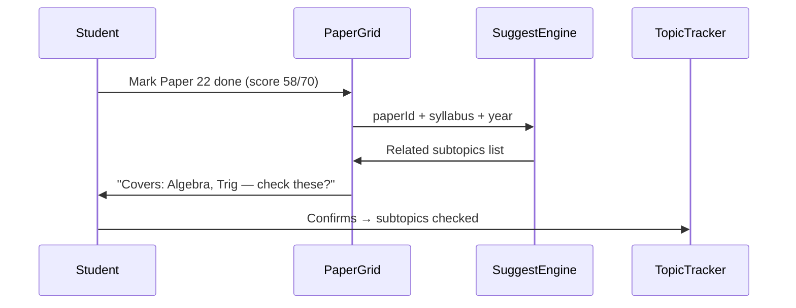

# Phase 4 — Topic ↔ Past Paper Linking

> **Status:** **Cancelled (user decision, 2026-09-19)**  
> Topic tracker and past paper tracker remain **fully independent**. Completing a past paper must **not** imply or auto-update topic mastery.  
> Do not implement `topic_paper_tags` or suggestion flows from this doc unless the user explicitly reopens the phase.

---

## Handoff prompt (paste into new chat)

```
Implement Phase 4 from docs/plans/phase-4-topic-paper-linking.md in The ANTS repo.

Prerequisites: Phase 1 merged. Phase 2 recommended for full CAIE A Level paper catalog.

Build topic ↔ past paper tagging so marking a paper done can suggest related subtopics
(manual confirm — NOT auto-complete without user action in v1).

Read:
- packages/db/src/schema/curriculums.ts (topics.subtopics JSON)
- apps/web/src/components/curriculum/TopicTracker.tsx
- apps/web/src/components/past-papers/PaperGrid.tsx

Start with pilot subjects: 0580, 4MA1, 9709 (if Phase 2 done).
Run npm run typecheck before finishing.
```

---

## Goal

Connect **what students practice** (past papers) with **what they study** (topic tracker) without the heavy "full integration" the user deferred in Phase 1.

**Phase 4 scope (v1):** Suggest and manual confirm  
**Future (Phase 6):** Auto-progress when confidence threshold met

---

## User journey



---

## Schema additions

### `topic_paper_tags` (catalog — seeded)
Links syllabus subtopics to paper **templates** (not individual year rows):

| Column | Type | Notes |
|--------|------|-------|
| `id` | TEXT PK | |
| `subject_id` | TEXT FK | |
| `topic_id` | TEXT FK | nullable — can tag whole topic |
| `subtopic_key` | TEXT | matches string in `topics.subtopics` JSON |
| `paper_number` | TEXT | base paper e.g. `2` |
| `variant` | TEXT | nullable — null = all variants |
| `weight` | REAL | 0–1 relevance (for sorting suggestions) |
| `source` | TEXT | `syllabus` \| `mark_scheme` \| `manual` |

### `user_topic_paper_links` (optional audit)
| Column | Notes |
|--------|-------|
| `user_id`, `past_paper_id`, `subtopic_key` | Record what user confirmed |

---

## Tagging strategy (phased within phase)

### Pass 1 — Rule-based (ship first)
- Map paper numbers to topic chapters using existing topic names:
  - 0580 Paper 1 → Number, Paper 2 → Algebra + Trig, etc.
- Seed `topic_paper_tags` from syllabus PDF section headers + paper descriptions in `past_papers.title`

### Pass 2 — Mark scheme extraction (optional stretch)
- Parse CAIE examiner reports / mark schemes if PDFs added later
- Tag at subtopic level with `source='mark_scheme'`

**Do not block v1 on Pass 2.**

---

## UI changes

### PaperGrid / InlineGradeCalc
After marking **done** with score:
1. Show `TopicSuggestionBanner` — list of 3–8 subtopics
2. Buttons: **Check all** | **Pick** | **Dismiss**
3. Calls `toggleSubtopicProgress()` batch via existing `curriculum.ts` action

### TopicTracker
- Show badge on subtopic: "Seen in 3 papers" (count from tags + user's done records)
- Filter: "Topics not yet covered by any done paper"

### Subject page
- Topics tab and Past Papers tab share same enrollment prefs (Phase 1)
- New stat: "Syllabus coverage %" = checked subtopics / total

---

## Pilot subjects

| Code | Why |
|------|-----|
| 0580 | Richest subtopic seed (0017); most students |
| 4MA1 | Edexcel 9–1 tier logic |
| 9709 | Multi-route; validates route-aware tagging (P42 vs P52 different applied tags) |

Expand to full catalog after pilot validates UX.

---

## Files to touch

| Layer | Files |
|-------|-------|
| Schema | New migration for `topic_paper_tags` |
| Seeds | `0031_topic_paper_tags_pilot.sql` |
| Actions | `curriculum.ts` — `suggestSubtopicsForPaper()`, `applyTopicSuggestions()` |
| UI | `TopicSuggestionBanner.tsx`, updates to `InlineGradeCalc.tsx`, `TopicTracker.tsx` |
| Scripts | `_gen_topic_paper_tags.py` — optional PDF parser |

---

## Acceptance criteria

- [ ] Marking 0580 Paper 22 done shows relevant subtopic suggestions
- [ ] User can confirm → subtopics checked in TopicTracker
- [ ] Dismiss does not check topics
- [ ] 9709 P42 vs P52 suggest different applied-math subtopics
- [ ] No auto-check without user action
- [ ] Coverage % visible on subject page
- [ ] `npm run typecheck` passes

---

## Explicitly NOT in Phase 4

- Flashcards/quizzes generation from tags → Phase 6
- ML-based topic extraction
- Auto-complete topics when score > 70%
