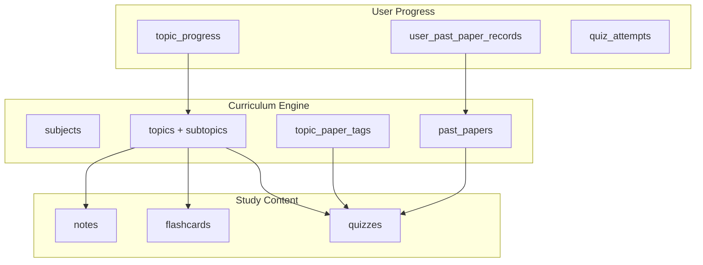

# Phase 6 — Study Content Layer (Notes, Flashcards, Quizzes)

> **Status:** Future  
> **Prerequisites:** Phase 1 + Phase 4 (topic-paper tags) + Phase 5 (deep subtopics) recommended  
> **Product direction:** Rebuild in-app from scratch (Notion pipeline retired per AGENTS.md)

---

## Handoff prompt (paste into new chat)

```
Plan and implement Phase 6 from docs/plans/phase-6-study-content-layer.md in The ANTS repo.

Prerequisites: Phase 1 merged. Phase 4 (topic_paper_tags) and Phase 5 (deep subtopics) strongly recommended.

Build the study content layer: notes, flashcards, and quizzes linked to curriculum topics/subtopics
and optionally to past paper questions. Follow AGENTS.md product rules (no Notion pipeline).

Read spec.md and docs/seeds/curriculum-spec.md before schema design.
Coordinate UI primitives in apps/web/src/components/ui/ per AGENTS.md shared UI rule.
```

---

## Goal

Use the curriculum engine built in Phases 1–5 as the **anchor** for interactive study content:



Architecture must **not require schema refactoring** of subjects/papers when adding content — Phase 1 `subject_component_routes` and topic structure are the foundation.

---

## Scope (high level — detail when phase starts)

### Notes
- Rich text or block editor per subtopic
- Student-authored + future contributor pipeline
- Link to syllabus code (`E1.1`)

### Flashcards
- Front/back tied to `topic_id` + `subtopic_key`
- SM-2 or simple spaced repetition
- Filter by subject, topic, "weak areas" from quiz results

### Quizzes
- Question bank tagged to subtopics
- Types: MCQ, short answer (manual self-mark v1)
- Optional: extract from past paper question patterns (not full PDF reproduction — copyright)

---

## Schema sketch (implementer validates)

```sql
-- notes
CREATE TABLE notes (
  id TEXT PRIMARY KEY,
  user_id TEXT NOT NULL,
  subject_id TEXT NOT NULL,
  topic_id TEXT,
  subtopic_key TEXT,
  title TEXT NOT NULL,
  content TEXT NOT NULL,  -- JSON blocks or markdown
  created_at INTEGER,
  updated_at INTEGER
);

-- flashcards
CREATE TABLE flashcards (
  id TEXT PRIMARY KEY,
  user_id TEXT NOT NULL,
  subject_id TEXT NOT NULL,
  topic_id TEXT,
  subtopic_key TEXT,
  front TEXT NOT NULL,
  back TEXT NOT NULL,
  next_review_at INTEGER,
  ease_factor REAL
);

-- quizzes (minimal v1)
CREATE TABLE quiz_sets (
  id TEXT PRIMARY KEY,
  subject_id TEXT NOT NULL,
  topic_id TEXT,
  title TEXT NOT NULL,
  created_by TEXT  -- user or 'system' seed
);

CREATE TABLE quiz_questions (
  id TEXT PRIMARY KEY,
  quiz_set_id TEXT NOT NULL,
  subtopic_key TEXT,
  prompt TEXT NOT NULL,
  options TEXT,  -- JSON for MCQ
  correct_answer TEXT NOT NULL,
  explanation TEXT
);
```

**Ownership:** Thaw Ye Zaw only (`packages/db`, `apps/web/src/actions/` per AGENTS.md).

---

## UI surfaces

| Route | Purpose |
|-------|---------|
| `/curriculum/[id]/[subjectId]/notes` | Notes list + editor |
| `/curriculum/[id]/[subjectId]/flashcards` | Review session |
| `/curriculum/[id]/[subjectId]/quizzes` | Quiz picker + attempt |
| Subject hub cards | Counts: notes, cards due, quiz avg |

Integrate with TopicTracker: "Study" button per subtopic → notes/flashcards/quiz for that objective.

---

## Seed content strategy

1. **Empty v1** — students create own content
2. **Contributor seeds (later)** — admin-approved question banks per subtopic
3. **Do not** scrape full past paper PDFs into quiz bank — link to practice externally or use original authored questions

---

## Dependencies from earlier phases

| Phase | Provides |
|-------|----------|
| Phase 1 | Subject routes, enrollment, component selection |
| Phase 4 | `topic_paper_tags` — "quiz me on what Paper 22 covers" |
| Phase 5 | Objective codes for precise tagging |

---

## Acceptance criteria (define fully when phase starts)

- [ ] Create/edit/delete notes linked to subtopic
- [ ] Flashcard review with basic spaced repetition
- [ ] Quiz attempt with score stored
- [ ] TopicTracker "Study" entry point works
- [ ] Role check: students create own; contributors TBD
- [ ] `npm run typecheck` passes
- [ ] No Notion dependencies

---

## Out of scope (even in Phase 6)

- AI-generated question banks (unless explicitly requested later)
- Collaborative real-time editing
- Public marketplace of notes
